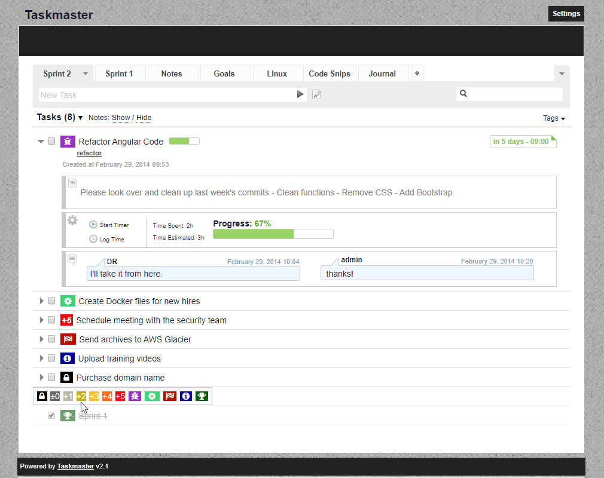

# Taskmaster

Taskmaster is a simple task, project, and information tracking application written in PHP, jQuery and AJAX. I've used this web application to track information for personal, home, and small development team projects.

# Copyright

This project is distributed under the GNU General Public License. Please see the included **COPYRIGHT** and **LICENSE-GPL3** for more information. Copyrights for portions of this file are retained by their owners.

# Features

## Database Support
 - SQLite
 - MySQL
 - PostgreSQL

## Multi-User Support
 - Groups: Admin, Read/Write, Readonly

## Multiple Task Lists
- Archive Lists
- Private Lists
- Public Lists

## Tasks
- Add Notes with Markdown Support
- Add Multiple Comments To Notes
- Track Time
- Notifications
- Set Tags with Tag Cloud
- Set Due Dates (Formats: y-m-d, m/d/y, d.m.y, m/d, d.m)
- Set Priority
    - Priority -1 thru +5
    - Locked
    - Bug
    - In Progress
    - Complete
    - Info
    - Milestone
- Sort Tasks and Lists using Drag-and-Drop
- Task TimeTable Graphs

## Search

## Password protection

## Smart Syntax
- Improves the creation of tasks
- (usage: /priority/ Task /tags/)

## Theme support
 - Multiple Color Themes
 - Print-Friendly CSS
 - Styled for mobiles devices

# Installation
- Modify the file/folder permissions on the following files/folders:
    - Configuration
        - /db - sudo chmod -R 775 db
    - Session Storage
        - /tmp - sudo chmod -R 775 tmp
- Create a new database if you plan to use MariaDB, MySQL, or PostgreSQL
- Navigate to **setup.php** in your web browser to begin installation

# Notes
A default admin user will be created during setup. If you enable multi-user support, use this account to login:

    User: admin
    Password: admin